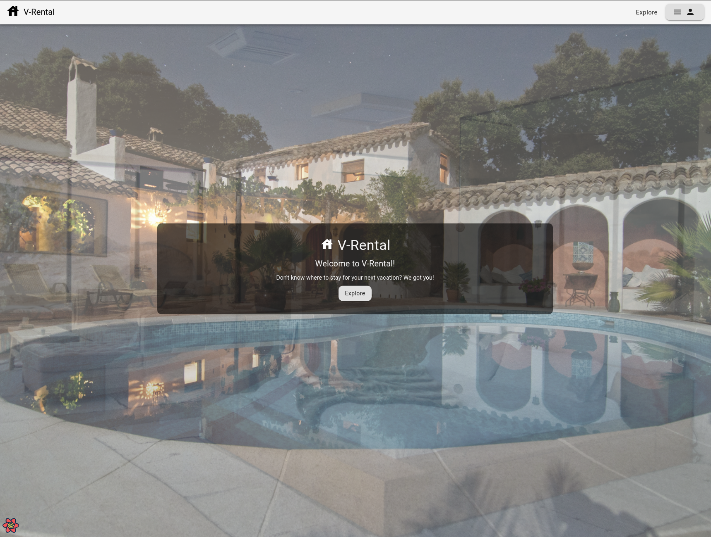
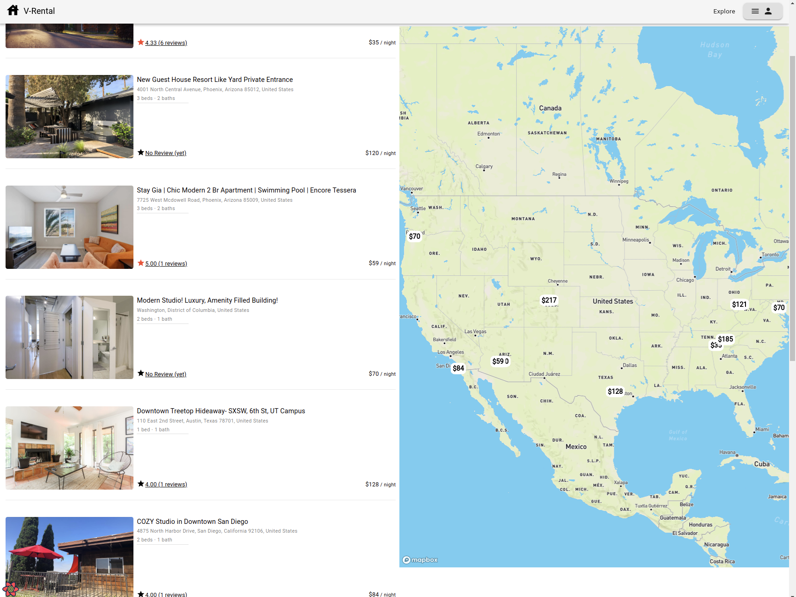
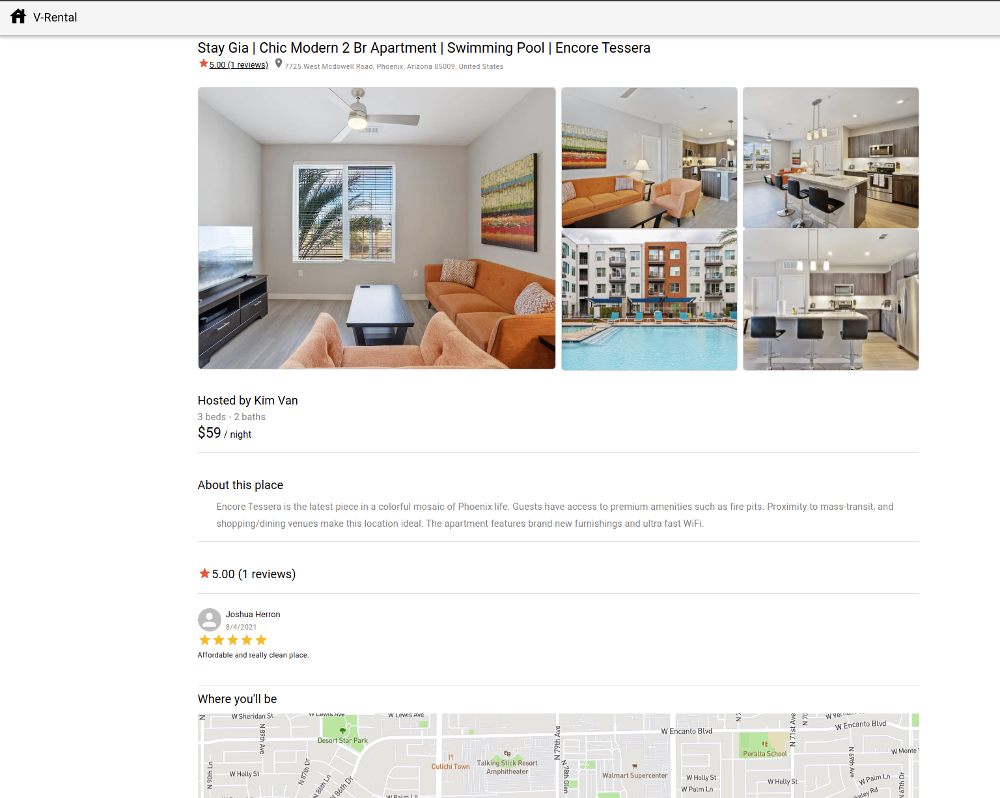
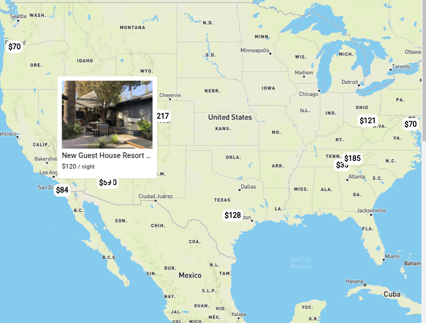

# vacation_renter

Clone the repository and run 
```
  docker-compose up
```
> Need to register free Cloudinary acount first, then create a .env file with the below format
```
CLOUDINARY_NAME=
CLOUDINARY_API_KEY=
CLOUDINARY_SECRET=
```

Run command
```
source .env
```

### Home Screen


### List view

### Detail view


### Map Box API
